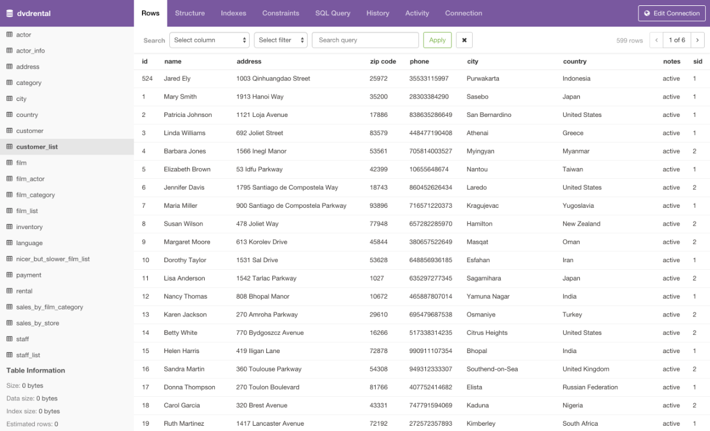

<!--
N.B.: This README was automatically generated by <https://github.com/YunoHost/apps/tree/master/tools/readme_generator>
It shall NOT be edited by hand.
-->

# Pgweb for YunoHost

[](https://ci-apps.yunohost.org/ci/apps/pgweb/)  

[](https://install-app.yunohost.org/?app=pgweb)

*[Read this README in other languages.](./ALL_README.md)*

> *This package allows you to install Pgweb quickly and simply on a YunoHost server.*  
> *If you don't have YunoHost, please consult [the guide](https://yunohost.org/install) to learn how to install it.*

## Overview

Pgweb is a web-based database explorer for PostgreSQL, written in Go. Distributed as a simple binary with zero dependencies. Very easy to use and packs just the right amount of features.

### Features

- Zero dependencies.
- Works with PostgreSQL 9.1+.
- Supports native SSH tunnels.
- Multiple database sessions.
- Execute and analyze custom SQL queries.
- Table and query data export to CSV/JSON/XML.
- Query history.
- Server bookmarks.


**Shipped version:** 0.16.1~ynh1

**Demo:** <https://pgweb-demo.fly.dev/>

## Screenshots



## Documentation and resources

- Official app website: <https://sosedoff.github.io/pgweb/>
- Upstream app code repository: <https://github.com/sosedoff/pgweb>
- YunoHost Store: <https://apps.yunohost.org/app/pgweb>
- Report a bug: <https://github.com/YunoHost-Apps/pgweb_ynh/issues>

## Developer info

Please send your pull request to the [`testing` branch](https://github.com/YunoHost-Apps/pgweb_ynh/tree/testing).

To try the `testing` branch, please proceed like that:

```bash
sudo yunohost app install https://github.com/YunoHost-Apps/pgweb_ynh/tree/testing --debug
or
sudo yunohost app upgrade pgweb -u https://github.com/YunoHost-Apps/pgweb_ynh/tree/testing --debug
```

**More info regarding app packaging:** <https://yunohost.org/packaging_apps>
