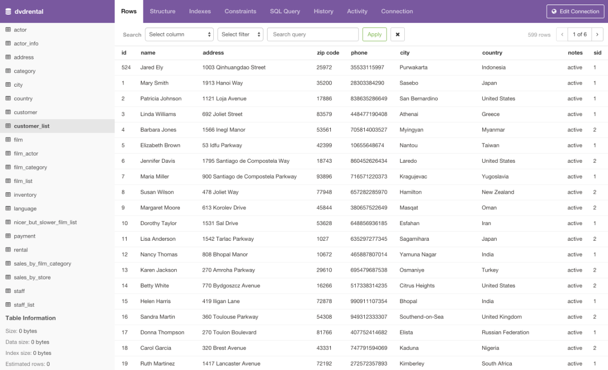

<!--
Este archivo README esta generado automaticamente<https://github.com/YunoHost/apps/tree/master/tools/readme_generator>
No se debe editar a mano.
-->

# Pgweb para Yunohost

[](https://ci-apps.yunohost.org/ci/apps/pgweb/)  

[](https://install-app.yunohost.org/?app=pgweb)

*[Leer este README en otros idiomas.](./ALL_README.md)*

> *Este paquete le permite instalarPgweb rapidamente y simplement en un servidor YunoHost.*  
> *Si no tiene YunoHost, visita [the guide](https://yunohost.org/install) para aprender como instalarla.*

## Descripción general

Pgweb is a web-based database explorer for PostgreSQL, written in Go, and works on Mac, Linux and Windows machines. Distributed as a simple binary with zero dependencies. Very easy to use and packs just the right amount of features.

### Features

- Cross-platform: Mac/Linux/Windows (64bit).
- Zero dependencies.
- Works with PostgreSQL 9.1+.
- Supports native SSH tunnels.
- Multiple database sessions.
- Execute and analyze custom SQL queries.
- Table and query data export to CSV/JSON/XML.
- Query history.
- Server bookmarks.


**Versión actual:** 0.16.0~ynh1

**Demo:** <https://pgweb-demo.fly.dev/>

## Capturas



## Documentaciones y recursos

- Sitio web oficial: <https://sosedoff.github.io/pgweb/>
- Repositorio del código fuente oficial de la aplicación : <https://github.com/sosedoff/pgweb>
- Catálogo YunoHost: <https://apps.yunohost.org/app/pgweb>
- Reportar un error: <https://github.com/YunoHost-Apps/pgweb_ynh/issues>

## Información para desarrolladores

Por favor enviar sus correcciones a la [`branch testing`](https://github.com/YunoHost-Apps/pgweb_ynh/tree/testing

Para probar la rama `testing`, sigue asÍ:

```bash
sudo yunohost app install https://github.com/YunoHost-Apps/pgweb_ynh/tree/testing --debug
o
sudo yunohost app upgrade pgweb -u https://github.com/YunoHost-Apps/pgweb_ynh/tree/testing --debug
```

**Mas informaciones sobre el empaquetado de aplicaciones:** <https://yunohost.org/packaging_apps>
